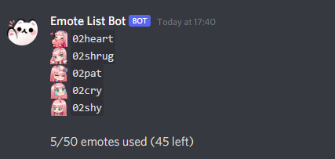

# EmoteListBot
Discord bot for creating a list of a guild's emotes.

## Requirements
- python
- [discord.py](https://github.com/Rapptz/discord.py)
- a bot application set up on [Discord's Developer Portal](https://discord.com/developers/applications/)

## Using the bot
- Run `bot.py` using `run.bat` or any other method
- When the bot asks, paste your bot token into the window and hit enter
- Invite the bot to your server
- Enter the channel you want the emote list to be in and use the `em!run` command (manage messages permission required)

## Preview

